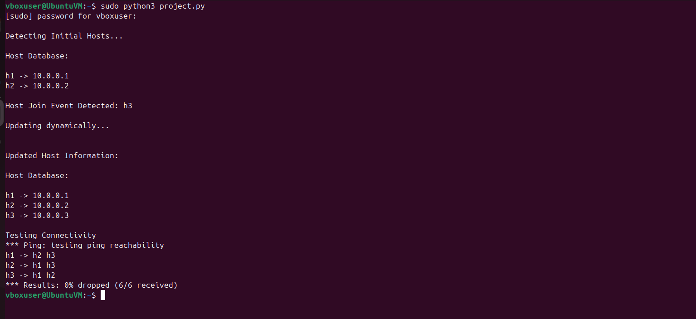

# Host-Discovery-Service-SDN
SDN Host Discovery Service using Mininet

##  Project Description
This project implements a Host Discovery Service in a Software Defined Network (SDN) environment using Mininet.

The system:
- Detects host join events
- Maintains a host database
- Displays host details
- Updates dynamically when a new host joins

---

##  Concepts Used
- Software Defined Networking (SDN)
- Mininet Network Emulator
- Open vSwitch (OVSBridge)
- Star Topology

---
##  Topology

```
      s1
     / | \
   h1  h2  h3
```
- s1 → Switch  
- h1, h2 → Initial hosts  
- h3 → Newly joined host  

---

##  How It Works

1. Initially detects hosts h1 and h2  
2. Stores them in host database  
3. Simulates a new host join event (h3)  
4. Updates the host database dynamically  
5. Displays updated host details  
6. Tests connectivity using pingAll()  

---

## ▶️ How to Run

### Install Mininet
```bash
sudo apt update
sudo apt install mininet -y
```
### Run the Project
```bash
sudo python3 SDN_Orange.py
```
## Sample Output



## Features

- Simulates an SDN network using Mininet  
- Detects hosts connected to the network  
- Maintains and updates host database dynamically  
- Displays host details with IP addresses  
- Uses Open vSwitch (OVSBridge) for packet forwarding  
- Verifies network connectivity using pingAll()    

---

##  Conclusion

This project demonstrates host discovery in SDN using Mininet.  
It shows how networks dynamically update when new hosts join.


 
